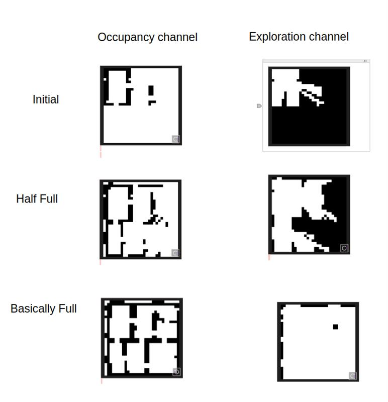

## Multi-robot SLAM in Isaac Sim (WIP)
# Overview

This project implements a simulation environment for multi-robot SLAM (Simultaneous Localization and Mapping) system in NVIDIA's Isaac Sim, and sets up the connection bridges to a macro control algorithm [CATMiP](https://arxiv.org/abs/2410.06372).

This system provides the environment that enables multiple robots to navigate and map an environment simultaneously, with each robot building its own occupancy map and sharing to the others. The project uses ROS2 for communication and coordination between robots, while Isaac Sim provides the simulation environment.

Prerequisites
- Ubuntu with ROS2 Humble installed
- NVIDIA Isaac Sim (installed in ~/isaacsim)
- Python 3.10+
- ROS2 packages:
    - [multislam_toolbox](https://github.com/kylrw/multislam_toolbox)
    - [turtle_navigation](https://github.com/kylrw/turtle_navigation) 
    - nav2
    - rviz2

# Demo


# Project File Structure

```
multiSLAM/
├── .gitignore
├── launch_multiSLAM.py          # Main script to launch multi-robot SLAM
├── launch_singleSLAM.py         # Script to launch single-robot SLAM
├── README.md
├── channels/                    # Communication channels
│   ├── global/                  # Global channel configurations for CATMiP
│   ├── robot1/                  # Robot 1 local channels
│   ├── robot2/                  # Robot 2 local channels
│   └── robot3/                  # Robot 3 local channels
├── channelUtils/                # Utilities for channel management
│   ├── channel_processing.py    # Process channel data
│   ├── pose_subscriber.py       # Subscribe to pose data
├── groundTruth/                 # Ground truth data
│   └── occupancy_map30x30.png   # Reference occupancy map for Isaac Sim scene
├── isaacsimUtils/               # Isaac Sim utilities
│   ├── load_isaacsim_stage.py   # Script to load the Isaac Sim stage
│   └── ros_utils.py             # ROS utilities for Isaac Sim
├── logs/                        # Log files
│   ├── isaacsim_log.txt         # Isaac Sim logs
│   ├── nav_log.txt              # Navigation logs
│   ├── robot1/                  # Robot 1 specific logs
│   ├── robot2/                  # Robot 2 specific logs
│   └── robot3/                  # Robot 3 specific logs
└── maps/                        # Generated maps
    ├── robot1/                  # Robot 1 specific logs
    ├── robot2/                  # Robot 2 specific logs
    └── robot3/                  # Robot 3 specific logs
```


# Setup

1. Follow these instructions to download and install [ROS2 Humble](https://docs.ros.org/en/humble/Installation/Ubuntu-Install-Debs.html) 

2. Download the custom ROS2 Libraries (above):
``` 
cd ~
mkdir ros2_ws
cd ros2_ws
mkdir src
cd src
git clone git@github.com:kylrw/multislam_toolbox.git
git clone git@github.com:kylrw/turtle_navigation.git
```

3. Build custom ROS2 Libraries
```
cd ~/ros2_ws/src
colcon build --symlink-install
```

2. Ensure [Isaac Sim 4.5.0](https://docs.isaacsim.omniverse.nvidia.com/latest/installation/download.html) is installed at ~/isaacsim


3. Clone this repository to your workspace
```
git clone git@github.com:kylrw/3D-Gridworld-Isaac-Sim.git
```


# Running the Multi-Robot SLAM

To launch the multi-robot SLAM system:

```
python3 launch_multiSLAM.py 
```

Command-line options:
- ```--debug``` Enable debug mode (runs additional visualization for each robot in rviz2)

# How It Works
1. The script first launches Isaac Sim with the specified scene
2. Then it
    1. Selects a random target location for the robots
    2. Launches SLAM components for each robot
    3. Launches navigation components for the robots
    4. Starts pose subscribers to monitor robot positions
3. Once running you'll be prompted to enter navigation goals for each robot
4. The system processes channel data for the CATMiP algorithm once robots reach their goals
5. To stop the simulation, press CTRL+C


# Channel Description

The channel processing scripts convert the information from the multislam_toolbox into the channels that CATMiP takes as input:



# Shutting Down

To safely shut down all components, press CTRL+C in the terminal running the script. The script will:

1. Stop all ROS2 processes
2. Kill the Isaac Sim process
3. Stop the ROS2 daemon